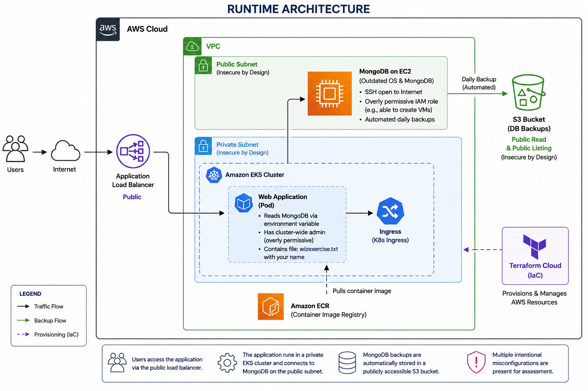
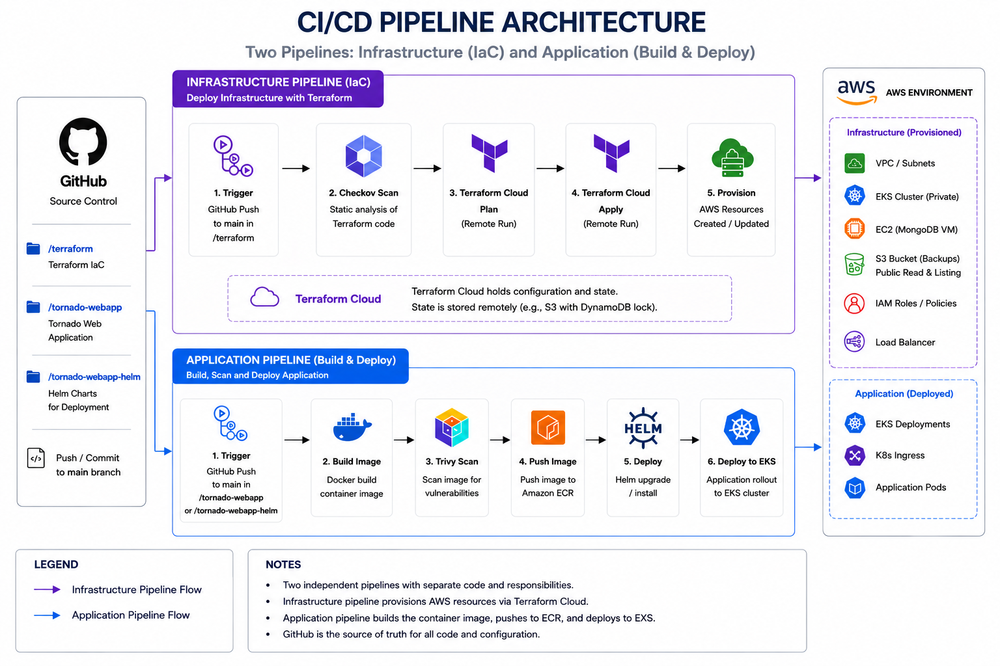

# Tech Task – Cloud Security Demo Environment

## Overview

This project provisions a deliberately vulnerable cloud-native environment in AWS to demonstrate common security misconfigurations and how they can be identified and analyzed.

The infrastructure is deployed using **Terraform** and the application is deployed via **GitHub Actions CI/CD** into **Amazon EKS**.

---

## Runtime Architecture



## CI/CD Pipeline



---

## Components

### Infrastructure (Terraform)
- VPC with public/private subnets
- EKS cluster (managed node group)
- EC2 instance running MongoDB
- S3 bucket for backups
- IAM roles and policies (intentionally over-permissive)
- AWS Load Balancer Controller (via Helm)

### Application
- Tornado web application (Docker)
- MongoDB backend

### CI/CD
- GitHub Actions pipeline:
  - Build image
  - Push to ECR
  - Deploy via Helm

---

## Security Misconfigurations (Intentional)

### 1. Overly Permissive IAM Roles
- EC2 instance has broad permissions (`ec2:*`, `iam:*`, `s3:*`)
- Terraform Cloud role has AdministratorAccess policy attached
- Demonstrates privilege escalation risk

### 2. Public S3 Bucket
- Allows public read + list
- Demonstrates data exposure

### 3. Outdated OS / Software
- Old Linux AMI (Running Ubuntu 24.04)
- Outdated MongoDB version (7.0)
- Unsupported Kubernetes version (1.29)

### 4. SSH Open to Internet
- `0.0.0.0/0` access on port 22

### 5. Kubernetes Admin Privileges
- App bound to `cluster-admin`

### 6. Secrets Stored in Github Repo
- Github action contains Mongo credentials base64 encoded

---

## Deployment

### Terraform Cloud

Push to main branch triggers `terraform plan` in Terraform Cloud. Changes to `/terraform` also triggers a Github action to run a Chekov code check. Currently failures do not prevent deployment.

### CI/CD

Changes pushed to tornado-webapp or tornado-webapp-helm triggers Github action to:

* Build webapp image
* Scan with Trivy
* Push to Amazon ECR
* Deploy to EKS Cluster

---

## Access

```
kubectl get ingress -n wiz-task
```

Open the ALB DNS URL.

---

## Verification

```
kubectl get all -n wiz-task
```

---

## Teardown

```
terraform destroy
```

---

# Security Controls (Recommended Improvements)

While this environment is intentionally insecure for demonstration purposes, the following controls could be implemented to significantly improve security posture. These controls are grouped across cloud, infrastructure, and code layers.

---

## ☁️ Cloud-Level Controls

**1. CloudTrail (Audit Logging)**
- Enable AWS CloudTrail across all regions
- Capture all control plane API activity
- Store logs in S3 for long-term retention
- Optional: integrate with CloudWatch for real-time alerting

**2. CloudWatch (Monitoring & Alerting)**
- Monitor:
  - Unauthorized API calls
  - Security group changes
  - IAM role modifications
- Create alerts for suspicious behavior

**3. AWS Config (Compliance & Drift Detection)**
- Track configuration changes across resources
- Detect:
  - Public S3 buckets
  - Overly permissive IAM roles
  - Open security groups
- Enforce compliance policies

**4. AWS Security Hub Config (Cloud Security Posture Management)**
- Security posture management and alert aggregation.
- Consolidated security findings from multiple AWS services and partners.

---

## 🏗️ Infrastructure-Level Controls

**1. Terraform Security Scanning**
- Use Checkov to scan IaC before deployment
- Detect misconfigurations such as:
  - Public S3 access
  - Overly permissive IAM policies
  - Open network access

**2. Deployment Gating**
- Terraform Cloud runs are gated behind CI checks
- Infrastructure is only deployed when:
  - Code passes security scans
  - Changes are approved and merged

**3. Least Privilege IAM**
- Replace overly permissive roles with scoped policies
- Limit access to only required services and actions

---

## 💻 Code & Pipeline Security Controls

**1. Repository Protection (GitHub)**
- Prevent direct pushes to `main`
- Require pull requests for all changes
- Require at least one reviewer approval
- Enforce status checks before merge

**2. Secret Scanning & Dependency Monitoring**
- Enable GitHub secret scanning
- Enable Dependabot alerts and updates

**3. Container Image Scanning**
- Use Trivy to scan images for vulnerabilities
- Identify:
  - Outdated packages
  - Known CVEs
- Results stored as pipeline artifacts

**4. CI/CD Security Enforcement**
- Pipeline enforces:
  - Checkov (IaC scanning)
  - Trivy (container scanning)
- Terraform Cloud plan/apply only occurs after:
  - Security scans pass
  - Code is reviewed and approved

---

## 🔐 Security Outcome

By implementing these controls:

- Unauthorized infrastructure changes are logged and traceable
- Misconfigurations are detected before deployment
- Vulnerable container images are identified early
- Only reviewed and compliant code reaches production

---

## 🧠 Summary

This layered approach demonstrates how security can be enforced across:
- **Cloud (visibility and auditing)**
- **Infrastructure (policy and configuration)**
- **Code and pipeline (preventative controls)**

In a production environment, these controls would work together to significantly reduce risk and improve overall security posture.
